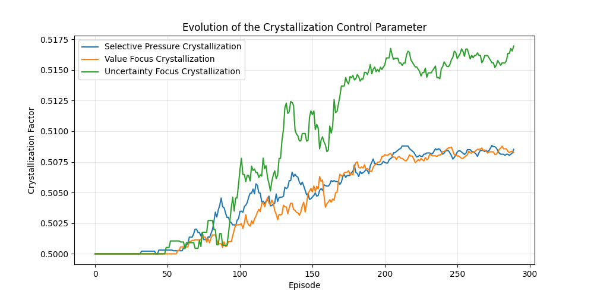

# Metalearning (WIP)

This repository explores the emergence of structured behavior in reinforcement learning systems through the lens of dynamical systems theory and pattern formation.

## Research Evolution & Key Findings

### Phase 1: Order Parameters

Wanted to identify a measurable quantity that would correlate with learning progress.

Initially investigated phase transitions in learning systems by identifying universal order parameters:

- Discovered strong correlation (-0.95) between gradient magnitude and agent performance
- Key insight: gradient magnitude acts as an order parameter (measurement) rather than control parameter, meaning that it is a measurement of the system's state rather than a parameter that can be directly manipulated to cause a phase transition. Which makes sense, the agent will naturally minimize weight updates as it approaches the optimal policy.

### Phase 2: Control Parameters

The jump from Phase 1 to 2 came from realizing the causation was backwards. Gradient magnitude wasn't causing good performance, it was a result of it. Like how temperature measures molecular motion but doesn't cause phase changes (heat flow does).

This led to developing active control mechanisms through `control_parameter.py`:



- Implemented β(s,t) selective pressure function to try to directly control the transition through selective pressure
- Tested different pressure configurations (value-focused vs uncertainty-focused)
- Found uncertainty-focused approach led to faster pattern formation (higher crystallization factor ~0.517 vs ~0.508)
- However, higher crystallization just meant more rigid/stable patterns formed, not necessarily better ones
- I.e, making patterns form quickly doesn't help if we can't guide them toward useful behaviors

### Phase 3: Pattern Formation (Current)

The shift from Phase 2 to 3 came from this limitation.
Rather than just trying to force patterns to form quickly, one must first understand the fundamental dynamics of how useful patterns emerge and spread.

Currently reframing through reaction-diffusion lens because:

- Learning patterns seem to emerge and spread like chemical patterns
- Well-studied mathematical frameworks exist for analyzing pattern formation
- Provides tools for understanding both local pattern formation and global propagation
- Focuses on what conditions lead to useful patterns, not just stable ones

## Implementation Details

The codebase currently includes:

1. `order_parameter.py`: Initial investigation of universal order parameters

   - Gradient magnitude analysis
   - Parameter sweeps across architectures
   - Visualization of phase transitions

2. `control_parameter.py`: Active control experiments
   - Selective pressure implementation
   - Crystallization tracking (measures pattern stability, not quality)
   - Multiple pressure configurations

## Running the Code

```bash
# Install dependencies
pip install -r requirements.txt

# Run order parameter analysis
python scripts/order_parameter.py

# Run control parameter experiments
python scripts/control_parameter.py
```
